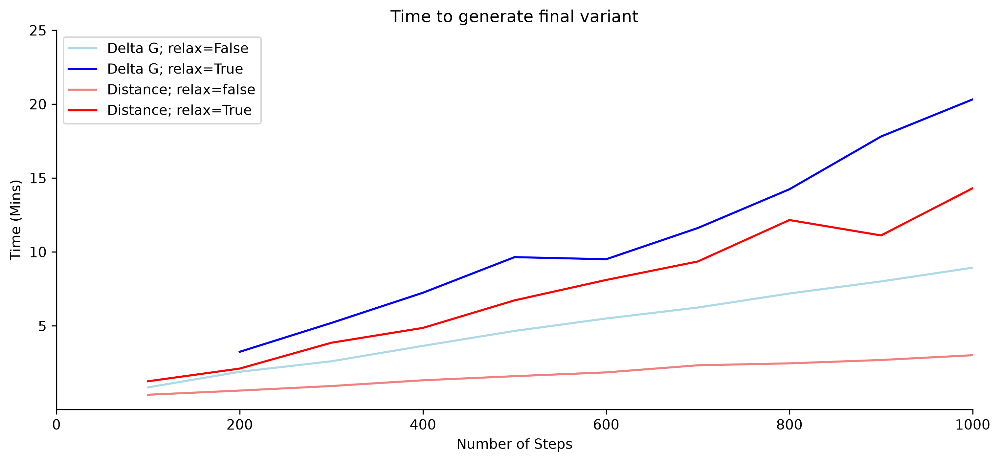
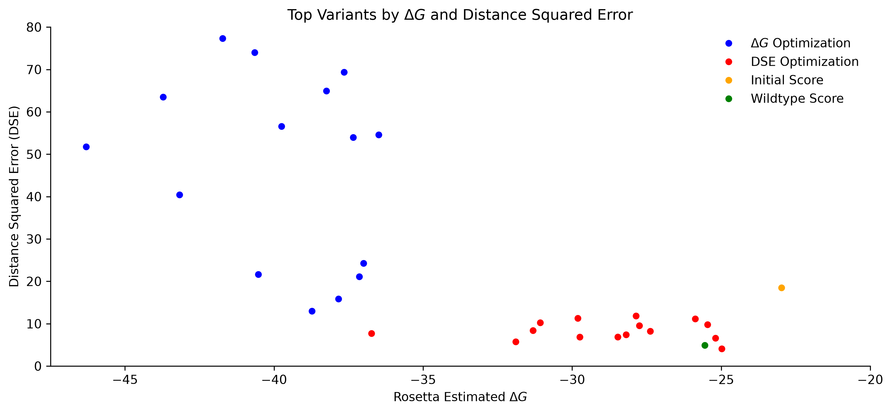
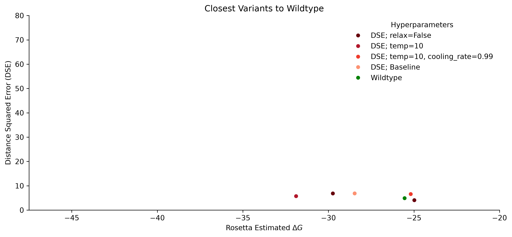
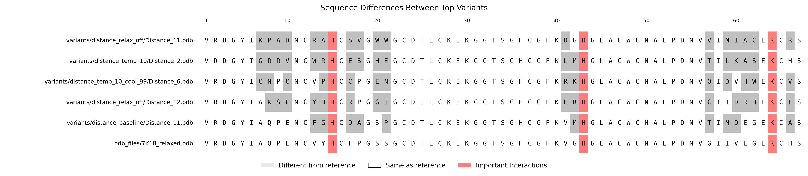

#  Toxin-Engineering

This project aims to engineer the scorpion toxin LQHIII to bind cardiac proteins. The workflow uses the experimentally verified NaV1.5–LQHIII complex as a starting point, modifies NaV1.5 to mimic cardiac proteins, and then engineers LQHIII to bind the resulting cardiac-like complex.

## ✨ Highlights

This project provides two reusable tools that may be useful for protein engineering and structural analysis:

- `insert_mutation`: Replaces one sequence motif with another motif in a protein structure.
- `AffinityOptimizer`: Redesigns a protein–protein binding interface to identify mutations that may improve binding affinity.

**Note:** The underlying implementation of these tools can be found in `utils.py`, while examples of their usage can be found in `demo.ipynb`.

The complete analysis is detailed in `project.ipynb` and consists of the following components:

1. Explore the experimentally verified wildtype NaV1.5–LQHIII complex.
2. Use `insert_mutation` to redesign NaV1.5 to mimic cardiac proteins.
3. Use `AffinityOptimizer` to engineer LQHIII and generate variants with potentially improved binding affinity for the cardiac-like NaV1.5.
4. Explore and evaluate the resulting variants.
   
## 🧬 Overview

## ⚙️ Usage Instructions

### <u>Project Setup</u>

1. Clone the repository and navigate into the project directory:
   
```
git clone https://github.com/jcapecci09/Toxin-Engineering.git
cd Toxin-Engineering
```

### <u>Environment Setup</u>

This analysis requires a Mamba environment. Ensure you have [Mamba installed](https://mamba.readthedocs.io/en/latest/installation/mamba-installation.html) before proceeding.

1. Create the environment from the file:

```
mamba env create -f mol-dyn.yml
```

2. Activate the environment:
   
```
conda activate mol-dyn
```

3. Register the environment as a Jupyter kernel:

```
python -m ipykernel install --user --name mol-dyn --display-name "Python (mol-dyn)"
```

4. Launch Jupyter Notebook or VS Code and select **Python (mol-dyn)** as your active kernel.

5. Work through `project.ipynb` to produce results

## 📊 Results

### Runtime


### Best Variants





## 👤 Author

I'm [Jimmy Capecci](https://github.com/jcapecci09), a Bioinformatics graduate student at Loyola University Chicago. I completed this project during my internship at the Stritch School of Medicine in the Peter Kekenes-Huskey Lab, where I explored computational approaches to protein engineering and structural analysis.

## 🙏 Acknowledgements

I'd like to thank Dr. Kekenes-Huskey and Alec Loftus at the Stritch School of Medicine for their guidance and support throughout this project.
